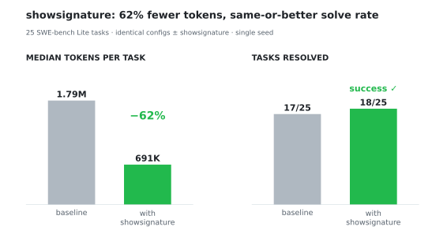

<p align="center">
  <picture>
    
  </picture>
</p>


# showsignature

Languages:
- English
- [简体中文](README.zh-CN.md)
- [日本語](README.ja.md)
- [Español](README.es.md)
- [Русский](README.ru.md)
- [العربية](README.ar.md)

A CLI that extracts the useful structure from source files: signatures, imports, types, variables, comments, Markdown sections, and JSON shapes.

Use it to understand a codebase quickly, review files, or create compact context for AI assistants.


<p align="center">
  
</p>

## Benchmark

In an A/B experiment on 25 SWE-bench Lite tasks (SWE-agent, identical configs with and without showsignature), the agent solved the same or more tasks while the median task used **62% fewer tokens**:

<p align="center">
  <picture>
    <source media="(prefers-color-scheme: dark)" srcset="assets/towers-dark.svg">
    
  </picture>
</p>

<sub>Setup: SWE-bench Lite (n=25), SWE-agent 1.1.0, deepseek-v4-flash, $0.25/instance cost cap, 100-call limit, single seed. A case study, not a definitive benchmark.</sub>

## Install

> [!NOTE]
> How the tool is exposed depends on the agent: in **Pi** and **OpenCode** it registers as a **native tool call**, while in **Claude Code** and **Codex** it runs as a **bash command** (their harnesses integrate external tools through the shell).

<details id="claude-code">
<summary>
<h2>Claude Code</h2>
</summary>

### 1. Install locally or globally
```sh
#npm|pnpm|yarn
# global install
npm install -g showsignature
# local install
npm install showsignature
```

### 2. Set the Agent
  
```bash
/plugin marketplace add FredySandoval/showsignature
```

```bash
/plugin install showsignature@showsignature
```
(You have to send two separate prompts for the install to work)

The desktop app has no /plugin command. Install it from the UI instead: Customize, the + by personal plugins, Create plugin and add marketplace, Add from repository, then enter the repo URL.

The agent invokes `showsignature` as a bash command.
</details>


<details id="codex">
<summary>
<h2>Codex</h2>
</summary>

### 1. Install locally or globally
```sh
#npm|pnpm|yarn
# global install
npm install -g showsignature
# local install
npm install showsignature
```

### 2. Set the Agent

```sh
codex plugin marketplace add FredySandoval/showsignature
codex
``` 
Open /plugins, select the `showsignature` marketplace, and install `showsignature`. Then open /hooks, review and trust its lifecycle hook, and start a new thread.

This same install also covers the Codex desktop app: restart the app after installing and it picks up the plugin.

The agent invokes `showsignature` as a bash command.

</details>

<details id="pi-agent-extension">
<summary>
<h2>Pi agent extension</h2>
</summary>
  
```bash
# option 1
pi install npm:showsignature
# option 2
pi install git:github.com/FredySandoval/showsignature
# option 3
pi install https://github.com/FredySandoval/showsignature
```

The extension registers `showsignature` as a native tool call.
</details>

<details id="opencode">
<summary>
<h2>OpenCode</h2>
</summary>

### Option 1: CLI

```sh
opencode plugin showsignature@0.2.2 --global
```

### Option 2: config file

Add the plugin to your `opencode.json` (project or `~/.config/opencode/opencode.json` for global):

```json
{
  "$schema": "https://opencode.ai/config.json",
  "plugin": ["showsignature@0.2.2"]
}
```

OpenCode installs the package automatically at startup and registers the `showsignature_map` and `showsignature_read` tools — the agent calls them as native tools, no shell involved.

> [!NOTE]
> Pin an exact version as shown above and update it manually on new releases. OpenCode caches the plugin by its version specifier, so an unpinned (or `@latest`) install is resolved once and never refreshed — publishing a new version to npm won't reach you until the pinned version changes (or you clear `~/.cache/opencode/packages/`).

> [!NOTE]
> You may need to have installed `node` or `bun`.
</details>


<details id="agent-skill">
<summary>
<h2>Other Agent Harnesses (SKILL)</h2>
</summary>

### 1. Install locally or globally
```sh
#npm|pnpm|yarn
# global install
npm install -g showsignature
# local install
npm install showsignature
```
  
### 2. install the agent skill

```bash
# All agents
npx skills add https://github.com/FredySandoval/showsignature --skill showsignature
```
</details>


<details id="from-source">
<summary>
<h2>From source code</h2>
</summary>
  
```bash
git clone https://github.com/FredySandoval/showsignature.git
cd showsignature
pnpm install
pnpm build
pnpm link --global
```
</details>

## Why?

Large files are noisy. `showsignature` gives you the shape of a project before you read the implementation:

- What functions/classes exist?
- What does each file import/export?
- What types and interfaces define the data?
- What headings/tables/code blocks exist in Markdown?
- What shape does a JSON file have?

<!-- generated:instructions:start -->
<!-- Everything until the end marker is GENERATED from src/00-instructions.ts — edit there and run `pnpm gen`. -->

## Usage

```sh
showsignature map  [OPTION]... [PATH]...
showsignature read [OPTION]... <FILE>
```

Two commands:

- `map` — structural overview: signatures and other extracted entries. Inspect [PATH] operands—files or directory paths—using the current directory by default.
- `read` — literal windowed read of exactly one file, with an optional structural outline around the window for orientation.

Running `showsignature` with no command prints help and exits with code 1.

Options for `showsignature map`:

| OPTION                 | Description                                                                  |
| ---------------------- | ---------------------------------------------------------------------------- |
| `--only <extractors>`  | Comma-separated extractors to run (default: `signatures,imports` for code files; `md:*` for Markdown; `json:shape` for JSON). |
| `--skip <n>`           | Skip the first N **entries** (default: 0).                                   |
| `--take <n>`           | Show at most N **entries**.                                                  |
| `--symbol-summary`     | Keyword-discovery mode: emit the identifier vocabulary per (extractor, file) as ripgrep-ready alternation patterns. Import specifiers are emitted as one whole token (relative paths reduced to their basename). See [Symbol summary](#symbol-summary). |
| `--max-depth <n>`      | Folder scan depth (directory scans default to `2`).                          |
| `--include-tests`      | Include test files in folder scans.                                          |
| `--no-line-number`     | Hide source line-number prefixes.                                            |
| `--lang <l>`           | Only process files of this language; required when using `-` to read stdin.  |
| `--all`                | Lift the output caps (entry limit and the 2000-line / 50 KB cap). Exception: `json:shape`'s nesting summary (`...`) is fixed. Omitted from the agent tool schemas on purpose — uncapped output would flood an LLM context; agents page with `--skip`/`--take` instead. |
| `--no-redact`          | Disable built-in secrets redaction.                                          |

Options for `showsignature read`:

| OPTION                   | Description                                                                   |
| ------------------------ | ----------------------------------------------------------------------------- |
| `--offset <line>`        | First **line** to show, 1-indexed (default: 1).                               |
| `--limit <n>`            | Max **lines** shown in the window.                                            |
| `--outline <extractors>` | Extractors used for the outline (default: `signatures`).                      |
| `--framing <mode>`       | How the content window is wrapped (default: `tags`). One of: `tags`, `none`.  |
| `--no-line-number`       | Hide line-number prefixes on outline lines (content never has them).          |
| `--lang <l>`             | Declare the file's language. Optional for stdin (`-`): content always displays; the outline needs a known language. |
| `--all`                  | Lift the 2000-line / 50 KB window cap. Omitted from the agent tool schemas on purpose — agents window with `--offset`/`--limit` instead. |
| `--no-redact`            | Disable secret redaction for literal bytes (redaction is disclosed otherwise).|

Remember the split: `map` works in **ENTRIES** (`--skip`/`--take`); `read` works in **LINES** (`--offset`/`--limit`).

Output is capped at 2000 lines / 50 KB by default; when a cap, a depth limit, or a
default filter (such as test-file exclusion) kicks in, the output ends with a single
`note:` trailer naming the exact flags or follow-up call to continue. The note is
mirrored to stderr when stdout is piped or redirected, so it stays visible.

## Extractors

Code files:

| Mode         | Shows                                                               |
| ------------ | ------------------------------------------------------------------- |
| `signatures` | Functions, classes, methods, constructors.                          |
| `imports`    | Import statements/declarations.                                     |
| `exports`    | JS/TS exports, exported Go declarations, and Python public exports. |
| `interfaces` | TypeScript/Go interfaces.                                           |
| `types`      | Type aliases/declarations.                                          |
| `variables`  | Variables/constants.                                                |
| `comments`   | Code comments.                                                      |

Markdown and JSON files:

| Mode            | Shows               |
| --------------- | ------------------- |
| `md:headings`   | Headings.           |
| `md:tables`     | Tables.             |
| `md:codeblocks` | Fenced code blocks. |
| `json:shape`    | JSON value shape.   |

## Supported files

| Language   | Extensions            |
| ---------- | --------------------- |
| TypeScript | `.ts`, `.mts`, `.cts` |
| JavaScript | `.js`, `.mjs`, `.cjs` |
| TSX/JSX    | `.tsx`, `.jsx`        |
| Svelte     | `.svelte`             |
| Go         | `.go`                 |
| Python     | `.py`                 |
| Rust       | `.rs`                 |
| Lua        | `.lua`                |
| Markdown   | `.md`                 |
| JSON       | `.json`               |

## Basic usage examples

`showsignature map [OPTION]... [PATH]...` / `showsignature read [OPTION]... <FILE>`

```sh
showsignature map ./src                                         # Inspect a folder
showsignature map src/01-main.ts                                # Inspect one file

showsignature map src/main.ts README.md tests/fixtures          # [PATH] can be one or more files/directories
showsignature map --only imports,exports ./src                  # Show imports and exports only
showsignature map --only signatures,imports,exports ./src       # Show code structure and imports
showsignature map --only interfaces,types ./folder              # Show data shapes
showsignature map --only variables,comments src/main.ts         # Show variables

showsignature map --only md:headings                            # Extract Markdown headings
showsignature map --only md:tables,md:codeblocks                # Extract Markdown tables
showsignature map --only json:shape config.json                 # Extract JSON shape

# useful when doing migrations from one language to other
showsignature map --lang py                                     # Process Python files only
showsignature map --lang go --only imports,exports              # Show Go imports and exported declarations
showsignature map --lang py --only types,comments               # Show Python imports and public exports
showsignature map --max-depth 4 ./                              # Repo-wide overview with an explicit scan depth

showsignature map --symbol-summary ./src                        # Ripgrep-ready identifier vocabulary per file
showsignature map --symbol-summary --only interfaces,types ./src # Domain vocabulary only

showsignature map --skip 40 --take 40 ./src                     # Page through a large entry listing
showsignature map --all ./src                                   # Lift the output caps (CLI only; omitted from agent tool schemas)
```

Read one file literally, with an optional structural outline around the window:

```sh
showsignature read src/01-main.ts                               # First lines of the file (up to the cap)
showsignature read --offset 200 --limit 100 src/01-main.ts      # Lines 200-299, outline around the window
showsignature read --outline imports,signatures src/01-main.ts  # Choose the outline extractors
showsignature read --framing none src/01-main.ts                # Plain read: no <content> tags, no outline
showsignature read --no-redact src/config.ts                    # Literal bytes, no secret redaction
cat snippet.py | showsignature read - --lang py                 # Stdin; --lang enables the outline
```

The outline lines carry real line numbers, so you can jump anywhere with
`showsignature read --offset <line> <file>`. The content between the `<content>` tags is
raw—no line-number prefixes—so it is safe to copy into exact-match edit tools.

Combine modes with commas:

```bash
showsignature map src --only signatures,imports,comments
```

## Symbol summary

`showsignature map --symbol-summary [OPTION]... [PATH]...` emits the identifier
vocabulary of a codebase as ripgrep-ready tokens: one line per (extractor, file)
pair listing the identifiers that literally exist there.

<details id="symbol-summary-spec">
<summary>Full specification</summary>

### Description

In an unfamiliar repository, the first search is usually a blind one: names
are guessed from generic conventions ("it's probably called `DATABASE_URL`")
rather than taken from the code itself. The repository may use its own naming
conventions, a different stack, or names its documentation no longer reflects.

**--symbol-summary** closes this gap. It reuses `map`'s existing extraction,
but instead of formatted structural output it emits **the vocabulary that
literally exists in the code** — a compendium of real identifiers to start
searching from. Scan the output, spot the suspicious name, then `rg` or
`showsignature map` *that* — no more guessing.

The flag is deliberately verbose: a primary consumer is LLM agents, and
`--symbol-summary` is self-describing at the call site.

The flag exists on `map` only. It is not available on `read`; use
`read --offset --outline` to orient around a location.

### Output format

One line per (extractor, file) pair, tokens separated by single spaces;
paths containing spaces are double-quoted:

```
<extractor>:<relative/path/to/file> token1 token2 token3
```

Example:

```
$ showsignature map --symbol-summary ./src
exports:src/db/pool.ts PgPool createPool POOL_MAX acquireConn
imports:src/db/migrate.ts runMigrations MigrationLock schemaVersion LogErrMig
exports:src/db/migrate.ts runMigrations MigrationLock
json:shape:src/config/default.json db host port poolMax migrationTable
```

- The extractor prefix says *why* a token is listed: an export is API
  surface, an import is dependency vocabulary, a variable is config
  vocabulary.
- A file may produce multiple lines — one per extractor that yielded
  tokens for it. They are never merged.
- Ordering is stable: file order first (same traversal order as normal
  `map`), extractor order second — output is diffable and deterministic
  across runs on an unchanged tree.
- Lines whose every token was stopworded are omitted.
- **No line numbers appear, ever**, regardless of `--no-line-number`.
  Regular `map` is the discovery tool for locations.

### The output contract

> Every token is a valid ripgrep pattern in default (regex) mode.

Every token exists verbatim in the corresponding source file (modulo
escaping). Regex metacharacters occurring in identifiers are escaped rather
than dropped — e.g. Svelte/PHP-style `$name` is emitted as `\$name`. Any
token is safe to paste, and joining tokens with `|` yields a valid
alternation:

```
rg "PgPool|createPool|POOL_MAX|acquireConn" src/db/pool.ts
```

### Token rules

- **Verbatim identifiers.** No splitting of compound identifiers:
  `getUserById` stays whole, `DATABASE_URL` stays whole. Splitting would
  break the output contract and produce noisy greps.
- **Import specifiers are emitted whole.** The quoted module specifier in
  an `imports`/`exports` entry contributes exactly one token, never path
  fragments. A relative specifier is reduced to its basename — the
  leading `./`/`../` segments vary per importing file and would break
  cross-file correlation — while package and module names are kept
  verbatim (metacharacters escaped):

  ```
  import type { Range } from "../../00-core-types.js";   →  Range 00-core-types\.js
  import * as ts from "typescript";                      →  ts typescript
  import "github.com/pkg/errors"                         →  github\.com/pkg/errors
  ```

  The same specifier token under `imports:` of several files tells you
  exactly who depends on that module.
- **First-occurrence order** per line, mirroring source order, so related
  terms cluster naturally. Exception: `json:shape` tokens follow the shape
  rendering, which sorts object keys lexicographically — order there
  mirrors the (sorted) rendering, not the source file.
- **Dedup within a line only.** A token appears at most once per line but
  may appear on multiple lines — seeing `runMigrations` under both
  `exports:src/db/migrate.ts` and `imports:src/cli.ts` tells you who
  defines it and who uses it. Repetition across lines is information;
  repetition within a line is noise.
- **Stopwords are purely syntactic.** Language keywords (`function`,
  `def`, `fn`, `pub`, `local`, …), primitive/builtin type names (`string`,
  `int`, `bool`, `void`, common JS/TS globals and utility types like
  `Promise`, `Set`, `Record`, …), and structural noise (`self`, `this`)
  are removed. The tables are per-language: each language drops its own
  keywords and builtins. Nothing is filtered for perceived relevance — if
  it's a name someone chose, it is kept.

### Extractor scope

Only extractors whose output is symbols — names that verifiably exist in
code or config — contribute:

| Included | Excluded |
| --- | --- |
| `signatures`, `imports`, `exports`, `interfaces`, `types`, `variables`, `json:shape` | `comments`, `md:headings`, `md:tables`, `md:codeblocks` |

Code and JSON config are ground truth; comments and Markdown are prose that
can reference names which no longer exist. JSON is deliberately included:
config keys are exactly the kind of token users grep for.

Explicitly requesting an excluded extractor is an **error**, not a silent
drop:

```
$ showsignature map --symbol-summary --only comments ./src
[error] --symbol-summary only applies to symbol extractors (names that
exist in code or config); comments is a prose extractor and cannot
contribute. Remove it from --only.
```

When `--only` is not given, the default extractor set applies with the
excluded extractors simply not contributing (Markdown files therefore
produce no output in this mode).

### Interaction with other options

| Option | Behavior |
| --- | --- |
| `--only` | Composes naturally: `--only interfaces,types` yields domain vocabulary; `--only signatures` yields verb vocabulary. Errors on excluded extractors. |
| `--skip` / `--take` | Page over **output lines** (extractor×file entries), not individual tokens. |
| `--no-line-number` | Redundant (no line numbers exist in this mode); accepted silently. |
| `--max-depth`, `--include-tests`, `--lang` | Unchanged. |
| `--all` | Lifts the output caps as usual. CLI only — omitted from the agent tool schemas so agents page with `--skip`/`--take` instead. |

Output is capped at 2000 lines / 50 KB as in normal `map`. When paging or a
cap truncates output, the trailing `note:` names the **exact** resume
command — the skip count is handed over, never guessed:

```
note: showing summary lines 1-2 of 6 — rerun with --symbol-summary --skip 2 --take 2 src
```

### Examples

```sh
# Full vocabulary of a source tree
showsignature map --symbol-summary ./src

# Domain vocabulary only (data shapes)
showsignature map --symbol-summary --only interfaces,types ./src

# Dependency vocabulary only
showsignature map --symbol-summary --only imports ./src

# Page through a large tree, two lines at a time
showsignature map --symbol-summary --take 2 ./src

# Follow up on a discovered name
rg "LogErrMig" src/
showsignature map src/db/migrate.ts
```

### Caveats

- **Relative import specifiers are reduced to their basename.** A line
  like `import { x } from "../../00-core-types.js"` contributes
  `00-core-types\.js`, not the full relative path — the `../` prefix
  differs per importing file, so the basename is what correlates across
  files. The basename still exists verbatim in the source (the contract
  holds), but grepping it may also match other references to the same
  filename, e.g. in build config.
- **JSON keys are kept whole** (`pool.max` → `pool\.max`), except keys
  containing whitespace, which split on the space — the shape rendering
  itself is space-delimited and cannot represent them unambiguously.
- **json:shape truncation drops keys.** Objects with more than 20 keys (or
  nesting past depth 5) are elided by the shape rendering; the elided keys
  do not appear in the vocabulary, the `...` marker itself is never
  emitted as a token (a literal `"..."` key is likewise dropped), and the
  trailing `note:` discloses the truncation. The cap is fixed — `--all`
  does not lift it.
- **Single-character tokens can appear** (e.g. a lone `s` from a template
  literal in a signature). They are verbatim and harmless, but rarely
  useful grep targets on their own.
- **Stopword tables are per-language and finite.** An unlisted builtin
  (e.g. a niche global type) may slip through as a token. This errs on the
  side of the feature's principle: keep chosen names, drop syntax.
- **Tokens are not scoped.** A parameter name and a top-level export look
  the same in the payload; the extractor prefix is the only context given.
- **Prose is invisible.** Comments and Markdown never contribute, by
  design — a name that exists only in documentation will not appear here.
  Use `map --only comments` or `map --only md:headings` for those.
- **Redaction applies.** Secret-looking values are redacted as elsewhere
  in `map` (disclosed in the `note:`); pass `--no-redact` for literal
  bytes.

### Out of scope (v1)

- `read --symbol-summary`
- Identifier splitting (a possible future `--split-identifiers` opt-in)
- Comments / Markdown extractors (would need natural-language stopwords)
- Any semantic relevance filtering

</details>

## Output

`showsignature` prints compact text output. Use shell redirection to save output to a file:

```bash
showsignature map src --only signatures > structure.txt
```

## Pipeline usage

`showsignature` writes to stdout by default, so it works well with tools like `rg`, `grep`, `fzf`, `less`, `head`, `tee`, and shell redirects.

```sh
showsignature map src --only imports | rg "node"                         # Find matching imports
showsignature map src --only signatures | rg "async"                     # Find async functions or methods
showsignature map src --only comments,signatures | rg -C 2 "ExtractKind" # Search comments/signatures with nearby context
showsignature map src --only signatures,imports | bat -l js              # Page through large output
```

<!-- generated:instructions:end -->

## Development

```bash
pnpm install
pnpm build
pnpm test
pnpm typecheck
pnpm format
```

## License

ISC. See [LICENSE](LICENSE).
