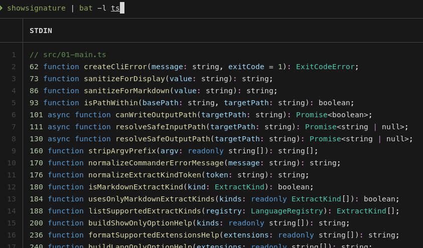

<p align="center">
  
</p>

# showsignature

A CLI that extracts the useful structure from source files: signatures, imports, types, variables, comments, and Markdown sections.

Use it to understand a codebase quickly, review files, or create compact context for AI assistants.

## Installation
### Step 1 Add the skill
```bash
# install in pi
pi install npm:showsignature
pi install git:github.com/FredySandoval/showsignature
pi install https://github.com/FredySandoval/showsignature

# All agents
npx skills add https://github.com/FredySandoval/showsignature --skill showsignature
```

### Step 2. Install locally or globally
```bash
# global install
npm install -g showsignature

# local install
npm install showsignature
```

From source for development:

```bash
git clone https://github.com/FredySandoval/showsignature.git
cd showsignature
pnpm install
pnpm build
pnpm link --global
```

```bash
# use without installing it
npx showsignature --help
```

Requires Node.js 18+.

## Why?

Large files are noisy. `showsignature` gives you the shape of a project before you read the implementation:

- What functions/classes exist?
- What does each file import/export?
- What types and interfaces define the data?
- What headings/tables/code blocks exist in Markdown?

## Usage

| Option | Description |
| --- | --- |
| `--file <file>` | Inspect one file. |
| `--folder <folder>` | Inspect a folder. |
| `--stdin` | Read source from stdin. |
| `--lang-only <lang>` | Force language, useful with stdin. |
| `--show-only <items>` | Choose extractors. |
| `--output <file>` | Save output. |
| `--include-tests` | Include test files in folder scans. |
| `--max-depth <n>` | Limit folder scan depth. |
| `--ignore-folder <name>` | Skip folders. |

## Extractors

Code files:

| Mode | Shows |
| --- | --- |
| `signatures` | Functions, classes, methods, constructors. |
| `imports` | Import statements. |
| `interfaces` | TypeScript/Go interfaces. |
| `types` | Type aliases/declarations. |
| `variables` | Variables/constants. |
| `comments` | Code comments. |

Markdown files:

| Mode | Shows |
| --- | --- |
| `md:headings` | Headings. |
| `md:tables` | Tables. |
| `md:codeblocks` | Fenced code blocks. |
| `md:all` | Full document. |


## Supported files

| Language | Extensions |
| --- | --- |
| TypeScript | `.ts`, `.mts`, `.cts` |
| JavaScript | `.js`, `.mjs`, `.cjs` |
| Go | `.go` |
| Python | `.py` |
| Markdown | `.md` |

## Basic usage examples

```bash
showsignature [--file <file> | --folder <folder> | --stdin] [options]
```

```sh
showsignature --help                                        # Show available options
showsignature --file src/01-main.ts                         # Inspect one file
showsignature --folder ./src                                # Inspect a folder
showsignature --folder .                                    # Inspect the current directory
cat src/01-main.ts | showsignature --stdin --lang-only ts   # Read TypeScript from stdin

showsignature --folder . --show-only imports                # Show imports only
showsignature --folder ./src --show-only signatures,imports # Show code structure and imports
showsignature --folder ./src --show-only interfaces,types   # Show data shapes
showsignature --file src/01-main.ts --show-only variables   # Show variables

showsignature --file README.md --show-only md:headings      # Extract Markdown headings
showsignature --file README.md --show-only md:codeblocks    # Extract Markdown code blocks
showsignature --folder . --show-only md:tables              # Extract Markdown tables

showsignature --folder . --lang-only py                     # Process Python files only
showsignature --folder . --max-depth 2                      # Limit recursive scan depth
showsignature --folder . --ignore-folder dist               # Skip a noisy folder
showsignature --folder src --show-only signatures,imports --output structure.md # Save compact context
```

Combine modes with commas:

```bash
showsignature --folder src --show-only signatures,imports,comments
```

## Pipeline usage

`showsignature` writes to stdout by default, so it works well with tools like `rg`, `grep`, `fzf`, `less`, `head`, `tee`, and shell redirects.

```sh
showsignature --folder src | rg "function|class" # Search extracted structure with ripgrep
showsignature --folder src --show-only imports | rg "node:" # Find matching imports
showsignature --folder src --show-only signatures | rg "async" # Find async functions or methods
showsignature --folder src --show-only comments,signatures | rg -C 2 "ExtractKind" # Search comments/signatures with nearby context
showsignature --folder src --show-only signatures,imports | less # Page through large output
showsignature --folder src --show-only signatures | head -50 # Preview the first 50 lines
showsignature --folder src --show-only signatures,imports | tee structure.md # View and save output
```
## Development

```bash
pnpm install
pnpm build
pnpm test
pnpm typecheck
pnpm format
```

## Troubleshooting

- Command not found? Use `node dist/02-cli.js --help` for local builds, or check your global npm bin path.
- Folder scan empty? Supported files only are scanned; `.gitignore` is respected; tests are skipped unless `--include-tests` is set.
- Stdin language unknown? Add `--lang-only ts`, `--lang-only py`, `--lang-only go`, or similar.

## License

ISC. See [LICENSE](LICENSE).
